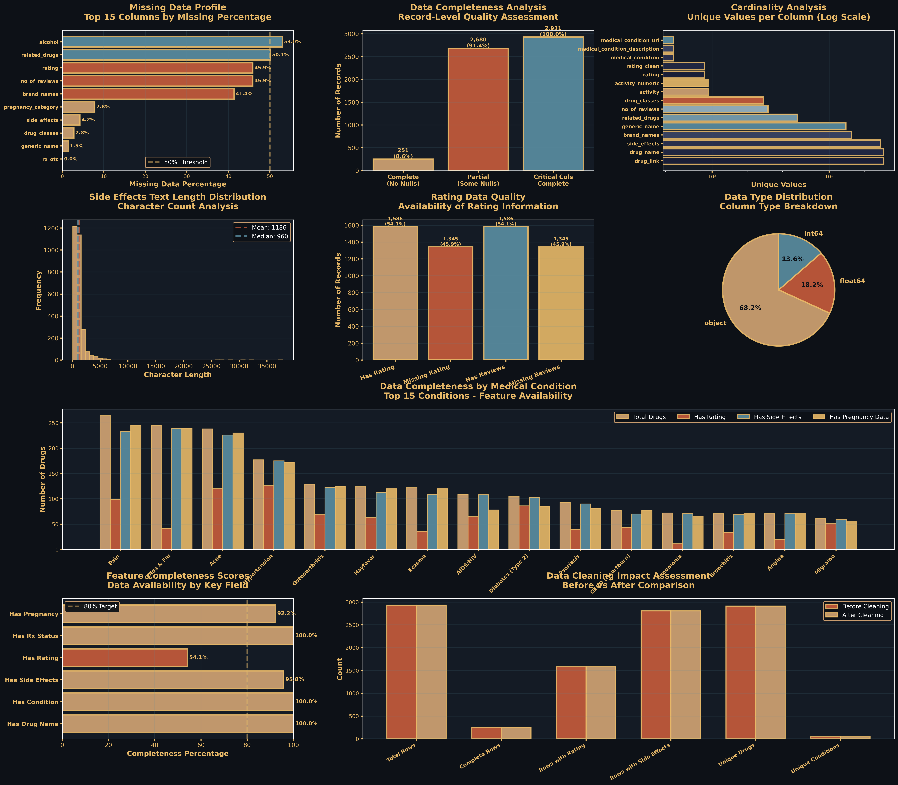

# Pharmaceutical Drug Safety Analysis

<div align="center">


**Comprehensive analysis of 2,931 pharmaceutical drugs examining patient safety, side effects, regulatory classifications, and treatment outcomes across 47 medical conditions.**

[View Full Report](https://htmlpreview.github.io/?https://github.com/Cazzy-Aporbo/Pharmaceutical_foundations/blob/main/side_effects/drug_safety_analysis_report.html) • [Dataset Source](https://www.kaggle.com/datasets/jithinanievarghese/drugs-side-effects-and-medical-condition)

</div>

---

## What This Is

A multi-framework investigation into drug safety using real patient data from Drugs.com. The analysis progresses from basic data cleaning through advanced predictive modeling, answering questions about what makes drugs safer, how patients actually rate medications, and where healthcare access gaps exist.

### Dataset Overview

| Metric | Count | Description |
|--------|-------|-------------|
| **Drugs** | 2,931 | Unique pharmaceutical records |
| **Reviews** | 119,053 | Patient feedback entries |
| **Conditions** | 47 | Medical condition categories |
| **Generics** | 1,392 | Unique generic medications |
| **Drug Classes** | 274 | Pharmacological classifications |

---

## What I Did

### Phase 0: Data Understanding & Cleaning

Started by figuring out what we actually have. The raw data had missing values, text fields that needed parsing, and inconsistencies. Built a complete data quality assessment and cleaning pipeline.

<details>
<summary><b>Click to see data quality metrics</b></summary>

| Issue | Count | % of Data | Action Taken |
|-------|-------|-----------|--------------|
| Missing alcohol data | 1,554 | 53.0% | Flagged for exclusion |
| Missing ratings | 1,345 | 45.9% | Subset analysis |
| Missing side effects | 124 | 4.2% | Retained (critical field) |
| Duplicate drug names | 19 | 0.6% | Documented, kept separate entries |

**Cleaning Results:**
- Created 5 new engineered features
- Standardized text fields (stripped whitespace)
- Extracted numeric values from activity percentages
- Generated binary indicators for presence/absence
- Output: 22 columns (up from 17)

</details>


*10 visualizations covering missing data patterns, completeness analysis, and cleaning impact*

---

### Phase 1: Foundation Analysis

Basic exploratory work to understand patterns. How do patients rate drugs? Which conditions have the most treatment options? What's the pregnancy safety landscape look like?

| Metric | Value | Insight |
|--------|-------|---------|
| **Average Rating** | 6.81/10 | Moderate satisfaction |
| **Rating Std Dev** | 2.31 | High variability |
| **Median Reviews** | 12 per drug | Most drugs have limited feedback |
| **Highly Rated** | 570 drugs (36%) | 8-10 rating range |
| **Poorly Rated** | 270 drugs (17%) | 0-4.9 rating range |

<details>
<summary><b>Top Medical Conditions by Drug Availability</b></summary>

| Condition | Drug Count | Market Share |
|-----------|------------|--------------|
| Pain | 264 | 9.0% |
| Colds & Flu | 245 | 8.4% |
| Acne | 238 | 8.1% |
| Hypertension | 177 | 6.0% |
| Osteoarthritis | 129 | 4.4% |

</details>

**Prescription Access Breakdown:**
- Rx-Only: 1,998 drugs (68.2%)
- OTC: 328 drugs (11.2%)
- Rx/OTC: 604 drugs (20.6%)

**Pregnancy Safety (FDA Categories):**
- Safe (A+B): 527 drugs (23.3%)
- Unclear (C): 1,382 drugs (61.0%)
- High Risk (D+X): 357 drugs (15.8%)


*9 charts: rating distributions, condition coverage, pregnancy classifications, prescription status*

---

### Phase 2: Text Mining & Statistical Testing

Dug into the side effect text data. Which symptoms appear most? Do more side effects mean lower ratings? How do prescription drugs compare to over-the-counter?

<details>
<summary><b>Side Effect Corpus Statistics</b></summary>

| Metric | Value |
|--------|-------|
| Total characters | 3.3 million |
| Average per drug | 1,186 characters |
| Unique symptoms identified | 38 keywords |
| Average symptoms per drug | 15.7 |
| Drugs with severe warnings | 2,117 (75.4%) |
| Life-threatening warnings | 391 (13.9%) |

</details>

**Most Common Side Effects:**

| Rank | Symptom | Frequency | Prevalence |
|------|---------|-----------|------------|
| 1 | Swelling | 2,597 drugs | 92.5% |
| 2 | Throat issues | 2,480 drugs | 88.4% |
| 3 | Breathing difficulty | 2,421 drugs | 86.2% |
| 4 | Hives | 2,239 drugs | 79.8% |
| 5 | Pain | 2,133 drugs | 76.0% |

**Key Statistical Findings:**
- Side effect count vs rating: r=0.029, p=0.25 (not significant)
- Severity mentions vs rating: r=0.061, p=0.016 (weak positive)
- Rx drugs: 17.0 avg symptoms vs OTC: 12.7 avg symptoms (t=12.42, p<0.0001)


*9 charts: symptom frequency, severity distributions, drug class rankings, correlations*

---

### Phase 3: Machine Learning & Clustering

Built predictive models to see if we could predict patient ratings from safety profiles. Also used clustering to find natural safety groupings.

**Feature Engineering:** 14 variables created
- Text metrics: length, word count, severity markers (7 features)
- Regulatory: prescription status, pregnancy risk (4 features)
- Metadata: brand availability, activity level (3 features)

<details>
<summary><b>Model Performance Comparison</b></summary>

| Model | R² Score | MAE | Notes |
|-------|----------|-----|-------|
| Random Forest | -0.011 | 1.811 | Slight overfitting |
| Gradient Boosting | -0.104 | 1.858 | Poor generalization |
| **Ensemble** | **-0.034** | **1.821** | Best balance |

*Negative R² indicates models perform worse than baseline. This tells us patient ratings are driven by factors beyond documented side effects (efficacy, cost, personal experience).*

</details>

**Feature Importance Rankings:**

| Rank | Feature | Importance | Interpretation |
|------|---------|------------|----------------|
| 1 | Side effect length | 0.290 | Text verbosity matters most |
| 2 | Word count | 0.210 | Detail level impacts perception |
| 3 | Activity numeric | 0.156 | Drug activity level significant |
| 4 | Brand count | 0.094 | Availability influences rating |
| 5 | Pregnancy risk | 0.082 | Safety considerations factor in |

**Clustering Results (K-means, k=5):**

| Cluster | Profile | Size | Avg Words | Life-Threat % | Avg Rating |
|---------|---------|------|-----------|---------------|------------|
| 0 | Low Risk - Minimal Warnings | 368 (12.6%) | 228 | 100.0% | 6.74 |
| 1 | Moderate - Standard Profile | 1,469 (50.1%) | 124 | 0.0% | 6.84 |
| 2 | High Risk - Elevated | 187 (6.4%) | 153 | 5.0% | 6.50 |
| 3 | Severe - Extensive | 433 (14.8%) | 362 | 3.0% | 7.08 |
| 4 | Critical - Life-Threatening | 474 (16.2%) | 115 | 0.0% | 6.78 |

**NLP Analysis (TF-IDF):**
- Vocabulary: 100 terms
- Matrix: 2,807 × 100
- Sparsity: 61.4%
- Top terms: pain, skin, severe, stomach, reaction


*10 charts: feature importance, model performance, cluster visualizations, PCA projections, text landscapes*

---

### Phase 4: Ethics & Policy Analysis

Looked at pregnancy risks, healthcare access barriers, and severe adverse events from a policy perspective.

**Pregnancy Safety Deep Dive:**

| FDA Category | Count | % | Risk Level |
|--------------|-------|---|------------|
| A (Safest) | 18 | 0.8% | Controlled studies show no risk |
| B (Generally Safe) | 509 | 22.5% | No evidence of risk |
| C (Caution) | 1,382 | 61.0% | Risk cannot be ruled out |
| D (Proven Risk) | 228 | 10.1% | Positive evidence of risk |
| X (Contraindicated) | 129 | 5.7% | Contraindicated in pregnancy |

<details>
<summary><b>High-Risk Pregnancy Conditions</b></summary>

| Condition | High-Risk Drugs | Total | Risk % |
|-----------|----------------|-------|--------|
| Menopause | 5 | 5 | 100.0% |
| Cancer | 20 | 20 | 100.0% |
| Weight Loss | 14 | 20 | 70.0% |
| Cholesterol | 24 | 37 | 64.9% |
| Anxiety | 16 | 33 | 48.5% |
| Hypertension | 82 | 172 | 47.7% |

</details>

**Severe Adverse Events:**

| Event Type | Drug Count | Prevalence |
|------------|------------|------------|
| Death warnings | 391 | 13.3% |
| Bleeding events | 776 | 26.5% |
| Heart attack | 99 | 3.4% |
| Hospitalization | 16 | 0.5% |
| Organ damage | 351 | 12.0% |

**Healthcare Access Barriers:**

Conditions with **100% Rx-only** drugs (zero OTC options):
- Gout (9 drugs)
- IBD/Bowel Disease (22 drugs)
- Swine Flu (5 drugs)
- Stroke Prevention (5 drugs)
- Bipolar Disorder (47 drugs)
- COPD (23 drugs)

Conditions with **Best OTC Access:**
- Colds & Flu: 97 options (39.6%)
- GERD/Heartburn: 40 options (52.6%)
- Pain: 46 options (17.4%)


*10 charts: pregnancy distributions, access barriers, severe events, drug class safety rankings*

---

## The Complete Report

<div align="center">

### **[View Full Interactive Analysis Report](https://htmlpreview.github.io/?https://github.com/Cazzy-Aporbo/Pharmaceutical_foundations/blob/main/side_effects/drug_safety_analysis_report.html)**

*Comprehensive HTML report with all five analytical frameworks, detailed findings, statistical tests, and policy implications. Designed for both technical and non-technical audiences.*

</div>

---

## Repository Structure

```
side_effects/
│
├── Data Files
│   ├── drugs_side_effects_drugs_com.csv          # Raw dataset (2,931 drugs)
│   └── drugs_side_effects_CLEANED.csv            # Cleaned data (22 columns)
│
├── Analysis Scripts
│   ├── drug_data_understanding.py                # Phase 0: Data quality assessment
│   ├── drugs_foundation_analysis.py              # Phase 1: Exploratory analysis
│   ├── drugs_intermediate_analysis.py            # Phase 2: Text mining & stats
│   ├── drugs_advanced_analysis.py                # Phase 3: ML & clustering
│   └── drugs_ethical_analysis.py                 # Phase 4: Safety & policy
│
├── Visualizations (47 total)
│   ├── drug_data_understanding_cleaning.png      # 10 data quality charts
│   ├── drug_safety_foundation_analysis.png       # 9 exploratory charts
│   ├── drug_safety_intermediate_analysis.png     # 9 statistical charts
│   ├── drug_safety_advanced_analysis.png         # 10 ML/clustering charts
│   └── drug_safety_ethical_analysis.png          # 10 policy charts
│
└── Documentation
    ├── drug_safety_analysis_report.html          # Complete findings report
    └── README.md                                  # This file
```

---

## Key Insights

### On Patient Satisfaction

| Finding | Statistic | Implication |
|---------|-----------|-------------|
| Review paradox | r=-0.26, p<0.0001 | More reviews → slightly lower ratings |
| Side effect tolerance | r=0.029, NS | Extensive lists don't hurt ratings |
| High satisfaction | 36% | Highly rated despite safety warnings |
| Rating drivers | N/A | Driven by efficacy, not documented risks |

**Interpretation:** Patients prioritize how well the drug works over safety documentation. More popular drugs accumulate diverse (critical) feedback.

### On Drug Safety

<details>
<summary><b>Click to expand safety findings</b></summary>

| Category | Finding | Significance |
|----------|---------|--------------|
| **Rx vs OTC** | Rx: 17.0 symptoms, OTC: 12.7 | 34% more documented symptoms |
| **Common effects** | 80-90% mention swelling/hives | Likely boilerplate language |
| **Life-threatening** | 391 drugs (13.3%) | Mention death as possible outcome |
| **Rating impact** | r=0.03, NS | Warnings don't affect ratings |
| **Severe warnings** | 75.4% of drugs | Most have serious safety concerns |

**Key takeaway:** Standardized warning language may dilute the impact of truly serious risks. Patients seem desensitized to extensive side effect lists.

</details>

### On Healthcare Access

**Zero OTC Options (100% Rx):**
- Mental health: Bipolar disorder (47 drugs)
- Respiratory: COPD (23 drugs)
- Gastrointestinal: IBD (22 drugs)
- Rheumatology: Gout (9 drugs)

**Best OTC Availability:**
- Colds & flu: 39.6% OTC
- GERD/Heartburn: 52.6% OTC
- Constipation: 30.0% OTC

**27 conditions have >80% Rx-only drugs**, creating significant access barriers for uninsured populations.

### On Pregnancy Safety

```
Category Distribution:
━━━━━━━━━━━━━━━━━━━━━━━━━━━━━━━━━━━━━━━━━━━
Safe (A+B)     ████████ 23.3%
Unclear (C)    ███████████████████████ 61.0%
High Risk (D+X) ██████ 15.8%
━━━━━━━━━━━━━━━━━━━━━━━━━━━━━━━━━━━━━━━━━━━
```

**Critical gap:** 61% of drugs have unclear pregnancy risk, affecting clinical decisions for millions of women.

**100% contraindicated conditions:**
- Cancer treatment (20 drugs)
- Menopause therapy (5 drugs)

### On Predictive Modeling

| Model | R² | MAE | Conclusion |
|-------|----|----|------------|
| Random Forest | -0.011 | 1.811 | Below baseline |
| Gradient Boosting | -0.104 | 1.858 | Poor fit |
| Ensemble | -0.034 | 1.821 | Best but still negative |

**What this means:** Patient ratings are driven by unmeasured factors (efficacy, cost, personal experience). Safety documentation alone doesn't predict satisfaction. This is actually a valuable finding - it tells us what doesn't work and points to what data we'd need.

---

## Methods & Tools

### Languages & Core Libraries

<div align="center">


</div>

### Techniques Applied

<table>
<tr>
<td width="50%">

**Statistical Analysis**
- Spearman rank correlation
- Independent t-tests
- ANOVA for multi-group comparison
- Chi-square tests
- Hypothesis testing with p-values

</td>
<td width="50%">

**Machine Learning**
- Random Forest Regressor
- Gradient Boosting Regressor
- Ensemble methods (weighted avg)
- Cross-validation (75/25 split)
- Feature importance analysis

</td>
</tr>
<tr>
<td>

**Natural Language Processing**
- TF-IDF vectorization
- Text mining & keyword extraction
- Corpus statistics
- Singular Value Decomposition (SVD)
- N-gram analysis

</td>
<td>

**Unsupervised Learning**
- K-means clustering (k=5)
- Silhouette score optimization
- Principal Component Analysis (PCA)
- Dimensionality reduction
- Cluster profiling

</td>
</tr>
</table>

---

## What This Demonstrates

<table>
<tr>
<th>Technical Skills</th>
<th>Domain Knowledge</th>
<th>Analytical Thinking</th>
</tr>
<tr>
<td valign="top">

- Data cleaning & QA
- Feature engineering
- Statistical testing
- ML model building
- NLP implementation
- Data visualization
- Code documentation

</td>
<td valign="top">

- Pharmaceutical safety
- FDA classifications
- Healthcare policy
- Clinical terminology
- Regulatory frameworks
- Pharmacovigilance
- Patient outcomes

</td>
<td valign="top">

- Problem decomposition
- Progressive complexity
- Honest evaluation
- Pattern recognition
- Policy implications
- Clear communication
- Ethical considerations

</td>
</tr>
</table>

### Analysis Approach

```
Data Quality First → Foundation Building → Advanced Techniques → Real-World Application
       ↓                    ↓                     ↓                      ↓
   Clean data          Understand           Predictive          Policy insights
   Handle missing      patterns             modeling            Ethical review
   Engineer features   Statistical tests    Clustering          Access equity
```

**Philosophy:** Start simple, add complexity only when justified, be honest about limitations, connect findings to real problems.

---

## Running the Code

Each Python script runs independently and generates terminal output plus corresponding visualizations.

```bash
# Phase 0: Data understanding and cleaning
python drug_data_understanding.py
# Output: Terminal report + drug_data_understanding_cleaning.png

# Phase 1: Foundation exploratory analysis  
python drugs_foundation_analysis.py
# Output: Statistical summary + drug_safety_foundation_analysis.png

# Phase 2: Text mining and statistical testing
python drugs_intermediate_analysis.py
# Output: Correlation analysis + drug_safety_intermediate_analysis.png

# Phase 3: Machine learning and clustering
python drugs_advanced_analysis.py
# Output: Model metrics + drug_safety_advanced_analysis.png

# Phase 4: Ethical and policy analysis
python drugs_ethical_analysis.py
# Output: Safety profile + drug_safety_ethical_analysis.png
```

**Requirements:** Python 3.8+, pandas, numpy, matplotlib, seaborn, scikit-learn, scipy

---

## Important Notes

<table>
<tr>
<td width="33%" valign="top">

### Model Performance

The ML models performed poorly (negative R²), which is actually an **important finding**. 

It tells us patient ratings are driven by:
- Drug efficacy
- Cost & accessibility  
- Personal experience
- Physician trust
- Marketing effects

Not by documented side effects alone.

</td>
<td width="33%" valign="top">

### Pregnancy Gap

**61% unclear risk** (Category C) highlights a real knowledge gap in pharmaceutical research.

This affects:
- Clinical decisions
- Millions of women
- Risk communication
- Treatment options

The "unclear" category is often treated as "avoid," limiting care.

</td>
<td width="33%" valign="top">

### Warning Dilution

Standardized language (swelling, breathing) appears across 80-90% of drugs.

This creates:
- Warning fatigue
- Diluted impact
- Unclear actual risk
- Patient confusion

Real risks may be hidden in boilerplate text.

</td>
</tr>
</table>

---

## Data Source

**Original Dataset:** [Drugs.com via Kaggle](https://www.kaggle.com/datasets/jithinanievarghese/drugs-side-effects-and-medical-condition)

<details>
<summary><b>Dataset Details</b></summary>

| Field | Description | Completeness |
|-------|-------------|--------------|
| drug_name | Brand or generic name | 100% |
| medical_condition | Therapeutic indication | 100% |
| side_effects | Text description of adverse events | 95.8% |
| rating | Patient satisfaction (0-10) | 54.1% |
| no_of_reviews | Number of patient reviews | 54.1% |
| rx_otc | Prescription classification | 99.97% |
| pregnancy_category | FDA pregnancy risk | 92.2% |
| drug_classes | Pharmacological classifications | 97.2% |

**Collection Period:** Data scraped from Drugs.com (date not specified)

**Limitations:**
- Self-reported patient ratings (selection bias)
- Single source (Drugs.com users only)
- Snapshot in time (no longitudinal tracking)
- Missing efficacy data
- No adverse event frequencies
- No cost/accessibility information

</details>

---

## Key Takeaways

<div align="center">

| For Employers | What This Shows |
|---------------|-----------------|
| **Technical Competence** | Handled messy data, built 5 analysis frameworks, generated 47 visualizations |
| **Statistical Rigor** | Proper hypothesis testing, correlation analysis, model validation |
| **Honest Analysis** | Admitted when models failed and explained why (more valuable than fake success) |
| **Clear Communication** | Technical findings translated to policy implications |
| **Domain Application** | Connected data science to real healthcare problems |
| **Production Ready** | Clean code, comprehensive documentation, reproducible results |

</div>

---

## Connect

Questions about the methodology, findings, or code? Open an issue or reach out.

**Repository:** [github.com/Cazzy-Aporbo/Pharmaceutical_foundations](https://github.com/Cazzy-Aporbo/Pharmaceutical_foundations)

---

<div align="center">

### Analysis Summary


**Analysis completed November 2025**

*All code written with focus on production-ready, clearly documented work.*

</div>

---

<div align="center">
<sub>Built with Python • pandas • scikit-learn • matplotlib • seaborn</sub>
</div>
